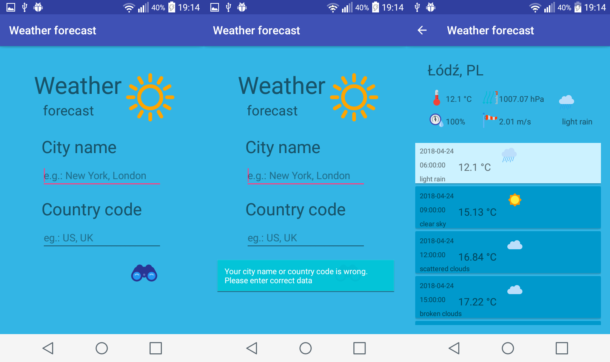

# Weather Forecast

Educational project realised in Kotlin for Android users

User need to enter city name and country code and then it has possibility to search weather forecast.
Forecast presents 5 days. Weather is displayed every 3 hours.
User can check:
    * temperature
    * humidity
    * pressure
    * wind speed

API: openweathermap.org
Icons: icons8.com, iconsplace.com